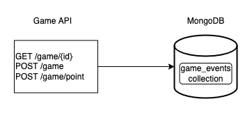

# Back Live Coding

## Business Logic

Basado en la Kata http://codingdojo.org/kata/Tennis/

Tennis Game

This Kata is about implementing a simple tennis game. I came up with it while thinking about Wii tennis, where they have simplified tennis, so each set is one game.
The scoring system is rather simple:

1. Each player can have either of these points in one game 0 15 30 40
   
2. If you have 40 and you win the ball you win the game, however there are special rules.
   
3. If both have 40 the players are deuce. a. If the game is in deuce, the winner of a ball will have advantage and game ball. b. If the player with advantage wins the ball he wins the game c. If the player without advantage wins they are back at deuce.

## Business Logic implementation
The business logic is divided into 2 services:  `gameService` y `scoreService`. The logic of both is explained below.:

### scoreService

This service manages the logic for managing changes in the state of the players' score. To do so, it implements the State design pattern following a functional style.

Basically, we have one function for each type of state that score can take (Love, Thirteen, etc). All these functions return an object with the same interface, but different behaviour ([here](#score) to see the common interface):

- name: Identifying name of the score (Love, Thirteen, etc)
- winBall: function that returns the score resulting from scoring a point. As input, it expects to receive the opponent's score.
- loseBall: function that returns the score resulting from the opponent scoring a point. As input, it expects to receive the opponent's score.

### gameService

This service is in charge of managing the status of a game every time a point is marked.
It receives as input the current game state, and the id of the player who has scored a point. It then updates the winning player's score and the losing player's score, using the common score interface.

## Architecture

The app is a Rest API created with the Express framework, which is connected to a MongoDB database to persist the application data.



### Routes

- **GET /game** Returns the current state of a game
- **POST /game** Saves a new event of type `new_game` in database
- **POST /game** Saves a new event of type `game_point` in database

More information in the app Swagger docs (http://localhost:400/api-docs) and [Postman collection](./docs/postman/back-live-coding-challenge.postman_collection.json)

### MongoDB

The database has only one collection `game_events` where the game events are stored. More information about game event entities [here](#game-events).

## Project Structure

All business logic is located in the `src` folder, divided into components. The main components are:

- App: Express configuration.
- Constants: app constants.
- Errors: app custom errors.
- Factories: factory functions to create the app entities.
- MongoDB: MongoDB configuration.
- Routes: API routes.
- Services: services containing the app business logic.
- Storage: functions to storage app data.

## Entities

### Game Events

- New Game Event

```json
{
  "type": "new_game",
  "id": 1,
  "player1Id": 1,
  "player2Id": 2,
  "timestamp": "1970-01-01T00:00:00Z"
}
```

- Game Point Event

```json
{
  "type": "game-point",
  "id": 1,
  "playerId": 1,
  "timestamp": "1970-01-01T00:00:00Z"
}
```

### Score: 
```json
{
  "name": "Love",
  "winBall": (opponentPlayerScore) => {},
  "loseBall": (opponentPlayerScore) => {}
}
```

### Player:
```json
{
  "id": 1,
  "score": {}
}
```
### Game:

```json
{
  "id": 1,
  "player1": {},
  "player2": {}
}
```

